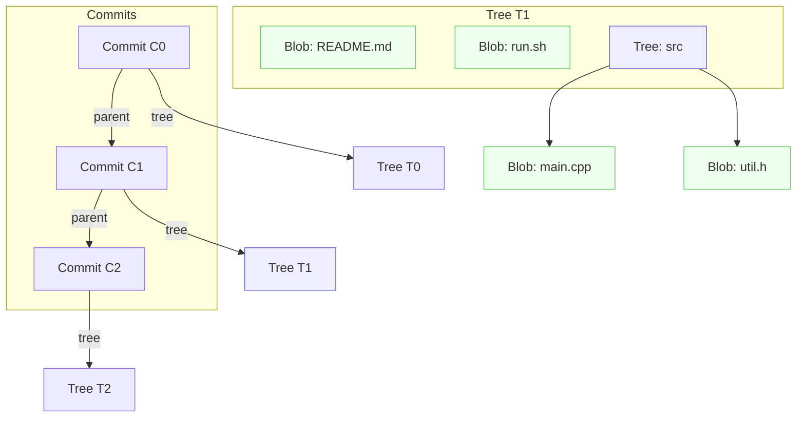

# Git 对象模型

## 总览
- Git 的对象存储采用内容寻址：对象数据按“类型头 + 内容”计算哈希，哈希值即对象 ID，数据以 zlib 压缩后存入 `.git/objects/`。
- 三类核心对象协作方式：`Commit` 指向一个工作目录快照 `Tree`；`Tree` 组织子目录与文件的树状结构；文件内容由 `Blob` 表示。多个 `Commit` 通过父引用形成有向无环图（DAG）。

| 对象类型 | 存储内容 | 作用 | 典型大小 | 唯一标识方式 |
|---|---|---|---|---|
| Blob | 纯文件字节数据 | 表示文件内容的不可变快照 | 与文件大小等同（压缩后变小） | 对 `header("blob <size>\\0") + content` 计算 SHA-1 |
| Tree | 目录条目列表（文件名、类型、权限、对象ID） | 表示目录结构与命名关系 | 视目录条目数而定（几十至几KB） | 对 `header("tree <size>\\0") + entries` 计算 SHA-1 |
| Commit | 元数据（指向 tree、父提交、作者/提交者、时间、消息） | 记录一次提交的快照与历史关系 | 数百字节至数KB | 对 `header("commit <size>\\0") + payload` 计算 SHA-1 |

说明：
- 唯一标识默认为 40 位十六进制的 SHA-1；现代 Git 可配置 SHA-256，但默认与兼容场景仍以 SHA-1 为主。
- 典型大小为对象未压缩数据的量级描述；实际存储为 zlib 压缩后数据。

## 对象功能详解

### Blob 对象
- 存储机制：
  - 数据格式为：`"blob <content_length>\\0" + <file_bytes>`。
  - 计算哈希（默认 SHA-1）时作用于上述完整字节序列（包含类型头与 NUL 字节）。
  - 存储路径为 `.git/objects/<前2位>/<后38位>`（zlib 压缩后内容）。
- SHA-1 哈希生成规则：
  - 令 `H = SHA1( header || content )`，其中 `header = "blob " + decimal(size(content)) + "\\0"`。
  - 对象 ID 为 `H` 的十六进制表示。
- 存储格式示例：
  - 假设文件内容为 `Hello\n`（6 字节），则：
    - 头部：`"blob 6\\0"`
    - 参与哈希的数据为：`62 6C 6F 62 20 36 00` + `48 65 6C 6C 6F 0A`（ASCII 十六进制示意）
  - 查看方式：`git hash-object <file>` 生成 ID；`git cat-file -p <id>` 能输出解压后的内容。

### Tree 对象
- 组织方式：
  - `Tree` 表示目录，包含若干条目；每个条目对应一个名字（文件或子目录）、权限模式与对象 ID（指向 `Blob` 或子 `Tree`）。
  - 条目二进制格式：`<mode> <name>\0<20字节对象ID二进制>`，其中 `<mode>` 为八进制权限（如文件 `100644`、可执行 `100755`、目录 `040000`、符号链接 `120000`、子模块 `160000`）。
- 文件名与 Blob 的映射：
  - 每个文件条目记录其文件名与对应的 `Blob` 对象 ID；目录条目记录其目录名与对应的 `Tree` 对象 ID。
- 权限信息的存储：
  - 以八进制模式记录在条目前缀（文本），如 `100644` 表示普通文件，`040000` 表示目录。
- 示例（`git cat-file -p <tree_id>` 的可读输出）：
  ```
  100644 blob <blob_id_1>    README.md
  100755 blob <blob_id_2>    run.sh
  040000 tree <tree_id_sub>  src
  ```
  注：以上为人类可读格式；真实对象内部用上述条目二进制布局。

### Commit 对象
- 组成要素：
  - `tree <tree_id>`：指向该次提交的根目录快照。
  - `parent <commit_id>`：零或多条；初次提交无父；合并提交有多个父。
  - `author <name> <email> <timestamp> <timezone>`：创作元信息。
  - `committer <name> <email> <timestamp> <timezone>`：提交者元信息（通常与 author 相同，在 rebase/cherry-pick 时会不同）。
  - 可选头：`encoding`、`gpgsig` 等。
  - 空行后为提交消息（commit message）。
- 父提交引用方式：
  - 通过一个或多个 `parent` 行，串接成历史 DAG；线性历史即每次一个父；合并会有两个及以上父。
- 时间戳与作者信息：
  - `timestamp` 为 Unix Epoch 秒；`timezone` 如 `+0800`。
  - 例：`author Alice <alice@example.com> 1700000000 +0800`
- 存储格式示例（`git cat-file -p <commit_id>`）：
  ```
  tree <TREE_SHA1>
  parent <PARENT_SHA1>
  author Alice <alice@example.com> 1700000000 +0800
  committer Bob <bob@example.com> 1700000300 +0800

  Initial commit
  ```

## 图示部分



说明：
- 每个 `Commit` 指向一个 `Tree` 快照；`Tree` 组织目录与文件；文件内容由 `Blob` 提供。
- `Commit` 通过 `parent` 形成链式历史；合并提交会有多个父指向。
- `Tree` 可嵌套：目录中的 `Tree` 再指向更多 `Blob` 或子 `Tree`，形成层次结构。

## 关键路径解释
- 写入文件 → 生成 `Blob`（内容寻址）  
- 整理目录结构 → 生成 `Tree`（条目列举，包含模式、名称、对象ID）  
- 形成提交 → 生成 `Commit`（指向 `Tree`，关联父提交与作者信息）  
- 读取时：`Commit` → `Tree` → 多个 `Blob` 与子 `Tree`，重建工作区快照

## 参考命令（实践）
- 查看对象内容：`git cat-file -p <obj_id>`
- 查看对象类型与大小：`git cat-file -t <obj_id>`、`git cat-file -s <obj_id>`
- 计算 Blob 哈希：`git hash-object <file>`（不写入对象库时加 `-w`）
- 列出树结构：`git ls-tree <tree_id>`